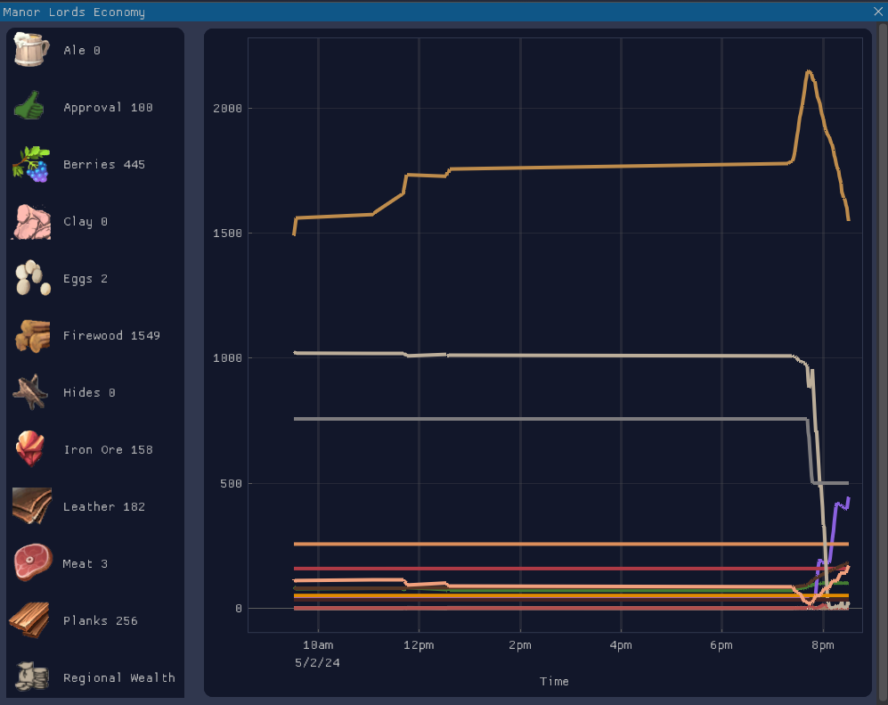

# manor-lords-addon

Lua script reads resource values from the memory and writes them to `values.csv` file.
Python app then uses the `csv` file to plot the data on a line chart and update it every x seconds.

